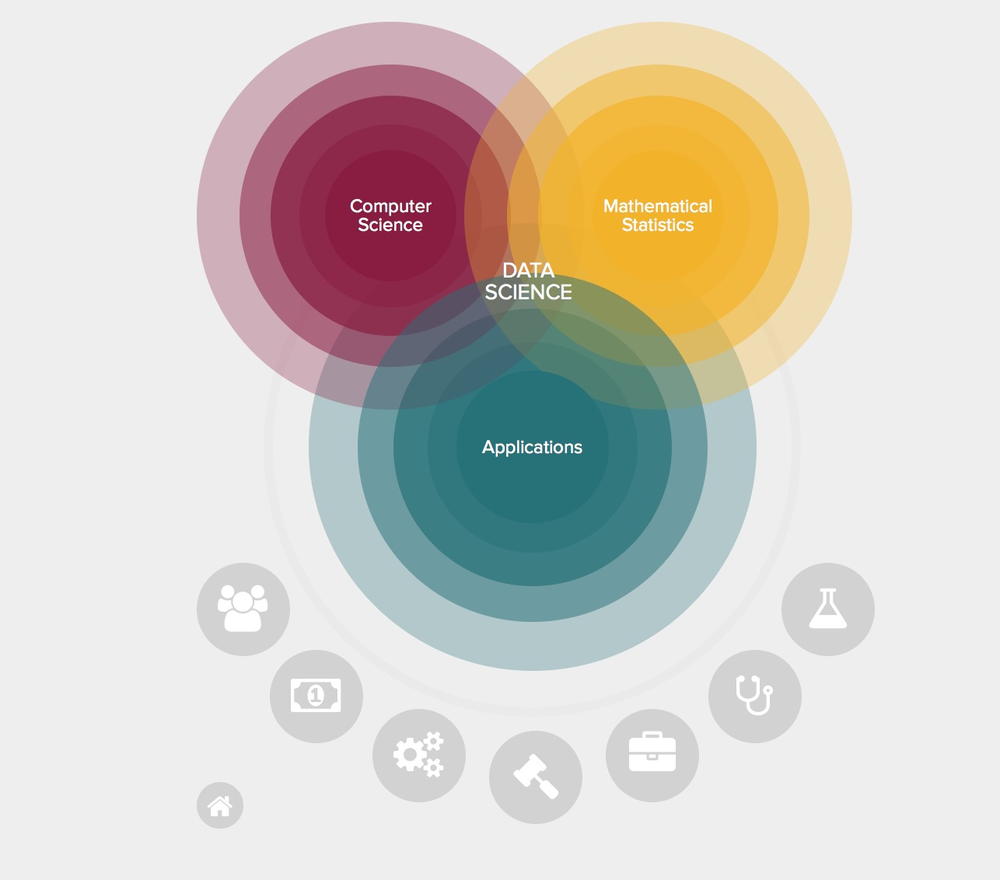

# Repository for Data Science in Python

## Content

- [Introduction](#introduction)
  - [What is Data Science](#what-is-data-science)
  - [What Skills to Know for Data Science](#what-skills-to-know-for-data-science)
- [Sources](#sources)

## Introduction
Data nowadays is produced more rapidly from labs, libraries, studios, etc. now then centuries combined before this time. In fact, according to studies 90 percent of the data we have now has been created in 2 years.[[1]](https://www.sciencedaily.com/releases/2013/05/130522085217.htm) This abundance of data gives us one of the biggest challenges and opportunities of the century to tackle, "We should somehow use and make sense out of this data." And the Data Science is alive...

### What is Data Science?
Data science is an interdisciplinary field about scientific methods, processes, and systems to extract knowledge or insights from data in various forms.[[2]](https://en.wikipedia.org/wiki/Data_science)

[[3]](http://datascience.nyu.edu/what-is-data-science/)

### What Skills to Know for Data Science

1. Basic Tools
2. Basic Statistics
3. Machine Learning
4. Multivariable Calculus and Linear Algebra
5. Data Munging
6. Data Visualization and Communication
7. Software Engineering
8. Thinking like a Data Scientist
[[4]](http://blog.udacity.com/2014/11/data-science-job-skills.html)

__1. Basic Tools:__

Whenever you go the statistical tools such as R and Python and data query language SQL or similar will be required. And as you see in the title of the repository I will be mainly working on **Python** for main language, and **PostgreSQl** or **MongoDB** for the data query language.

__2. Basic Statistics:__

It says basic statistics, because it's absolutely must for data scientist, and more advanced statistics is ideal. Some concepts are must known and some are very beneficial. For instance:

- p-value
- statistical tests
- distributions
- maximum likelihood estimators, etc.

__3. Machine Learning:__

Machine Learning is a field of itself under the Artificial Intelligence, but its very beneficial in data science. So, to be able to come up with some predictive models would definitely will take you up to very valuable place. You don't really have to become expert on the math behind machine learning there are libraries in both Python and R that allows you to easily use ready-to use functions.

I will not have advanced implementations here but will put a link to another of my repository called "Machine Learning and Beyond."

__4. Multivariable Calculus and Linear Algebra:__  

Okay, I know it's a bit scary to say you have to know Math but don't worry about it. You just have to know Linear Algebra and a little bit of Calculus. In case if some asks you to derive a formula or approach from a model, you should be able to answer them. For Linear Algebra, it's really a life saver when it comes to vector/matrix computations, believe me, it will help you to keep your sanity... :)

__5. Data Munging :__

It's the skill you will use a lot, I mean A LOT. The real life data has a lot of problems such as inconsistency, messy formats, missing values, etc. So get ready to spend most of your time to tidy up your data.

__6. Data Visualization and Communication:__

Visualization is the part that you will show off your findings. Because of the representing factor you have to be able to produce understandable, beautiful, basic, and insightful plots. There are tons of different libraries outside that you can select from:

- Matplotlib
- ggplot
- d3.js
- Seaborn
- Plotly
- Bokeh
- more...

__7. Software Engineering:__

This is obvious because at the end you will make a library/package or a workflow to make things available for other people. Knowing design patterns, algorithms, and software process is essential.

__8. Thinking like a Data Scientist:__

You have to think like one...

---

So data comes in all kind of shapes, and types. Wide range of formats, and wide range of sources yields to quite different types such as; collections of documents, collections of images, collections of sound clips, collections of numerical measurements. From all these heterogeneity, we use the data as numerical with NumPy arrays(most convenient).

## Sources

1. [Science Daily-Article about Data Producing](https://www.sciencedaily.com/releases/2013/05/130522085217.htm)
2. [Wikipedia-Data Science](https://en.wikipedia.org/wiki/Data_science)
3. [NYU-DataScience](http://datascience.nyu.edu/what-is-data-science/)
4. [Udacity-8 Skills to know..](http://blog.udacity.com/2014/11/data-science-job-skills.html)
